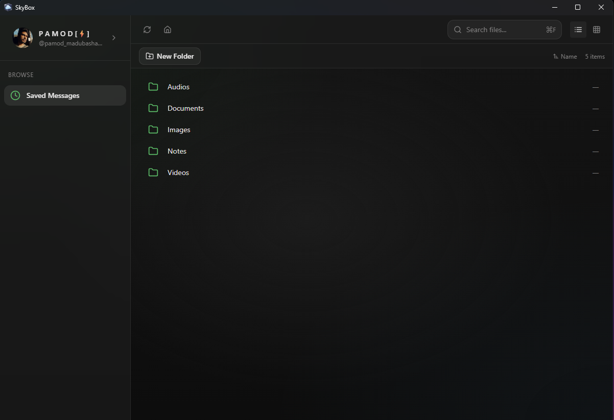
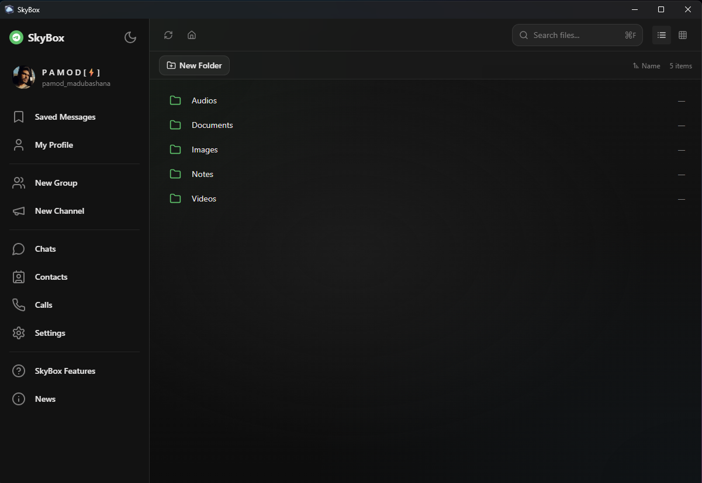
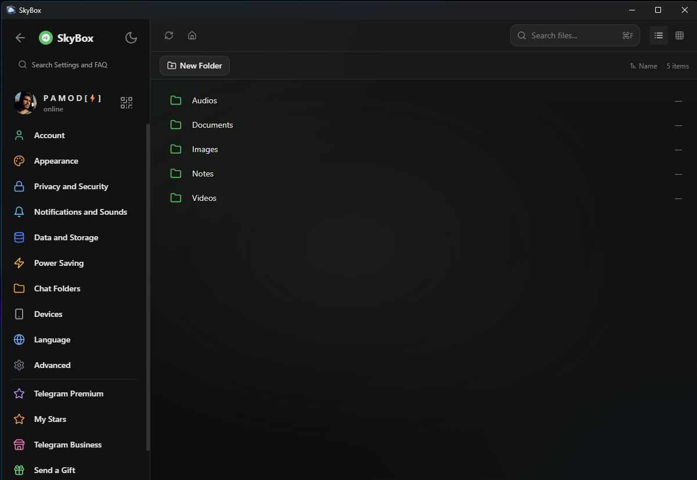
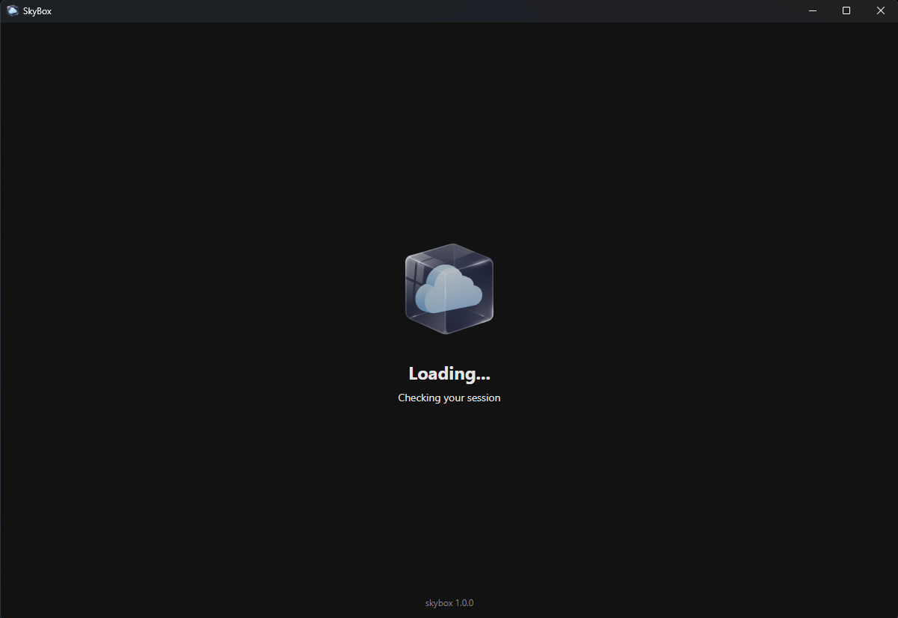
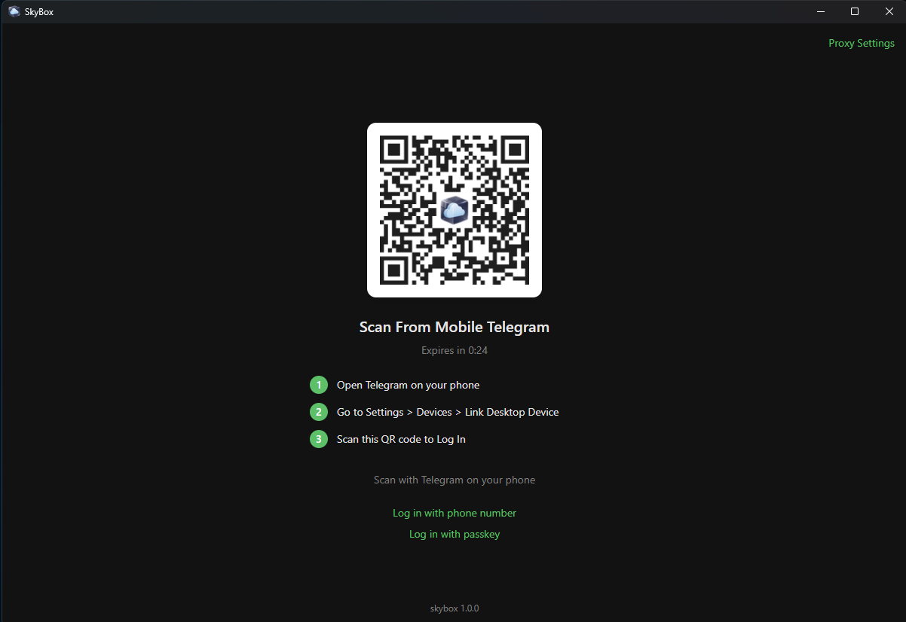
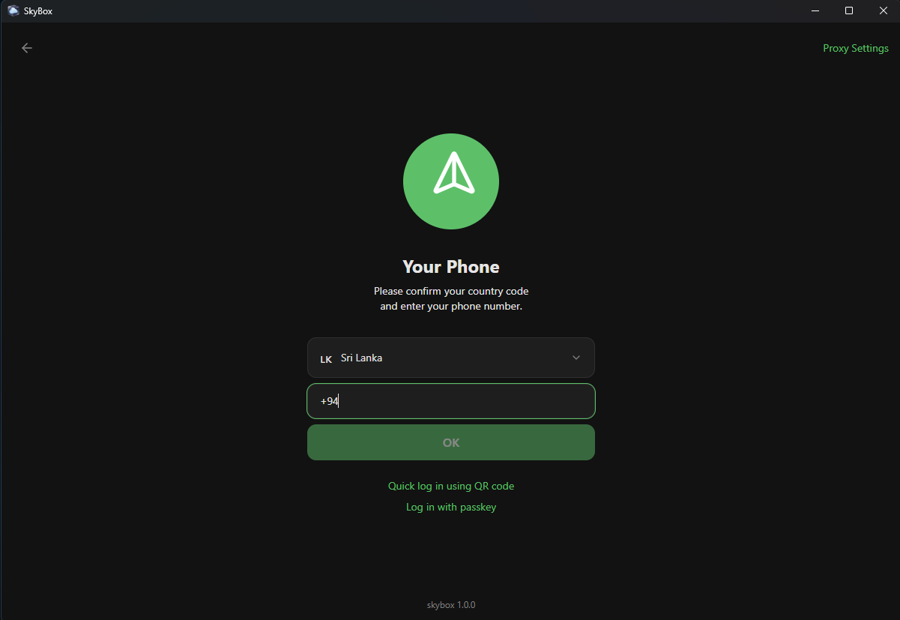

  <h1>SkyBox</h1>

  

  <h3>A Tauri-based file explorer application with Telegram integration</h3>

## Project Overview

SkyBox is a modern desktop file explorer application built with Tauri, React, and TypeScript. It combines traditional file management capabilities with innovative Telegram integration features, allowing users to seamlessly share files and communicate through Telegram directly from the application.

## Features

- **Modern UI/UX**: Built with React and Tailwind CSS for a sleek, responsive interface
- **File Management**: Browse, search, and manage files and folders with ease
- **Telegram Integration**: Direct integration with Telegram for file sharing and communication
- **Cross-platform**: Native desktop application powered by Tauri
- **Secure**: Built with security best practices for desktop applications

## Screenshots

  
    
  
    
  
    
  
    
  
    
  

## Tech Stack

- **Frontend**: React, TypeScript, Tailwind CSS
- **UI Components**: shadcn/ui
- **Backend**: Rust (Tauri)
- **Build Tool**: Vite
- **Platform**: Desktop (Windows, macOS, Linux)

## License

This project is licensed under the MIT License - see the LICENSE file for details.
